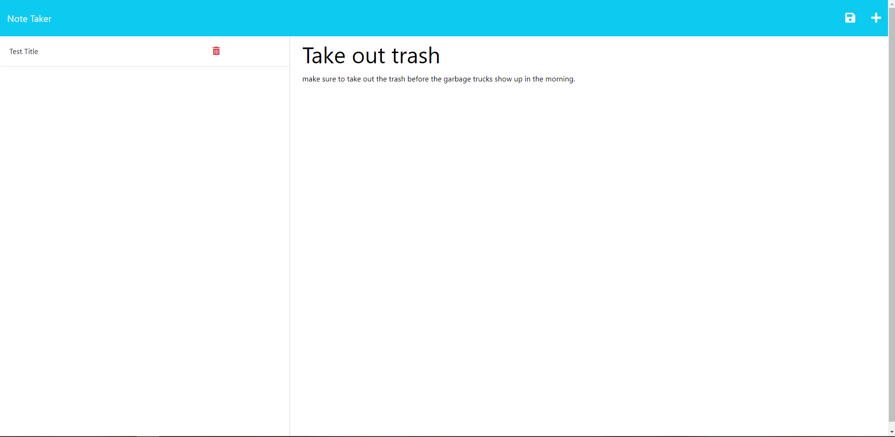
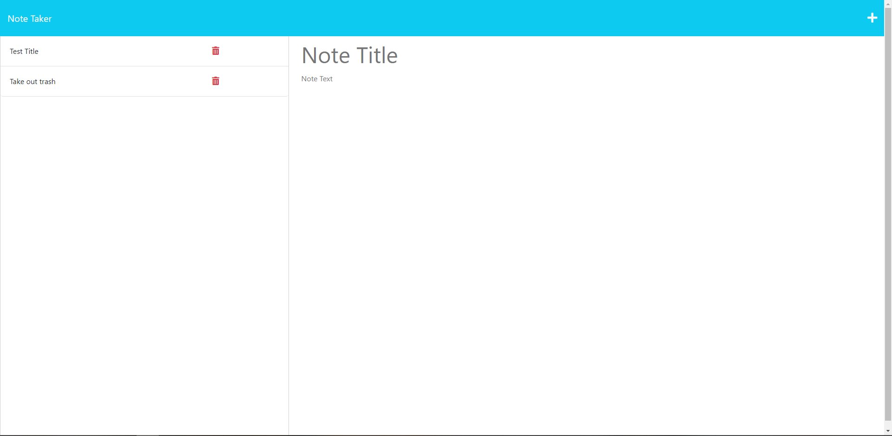

# Note-Taker

## Description
This is an application that allows you to write, store and delete notes. You are first introduced to a landing page which then redirects you to your notes manager.

## Installation
To install and initialize the code for yourself, clone this repo first. Then within your terminal run "npm install" to install the necessary files. The files that are needed to be installed are for "Express" and "Uuid".

## Screenshot of the Deployed Page

## Deployed App
[Click this to go to the Deployed App](https://secret-shore-27483-e634c1ce7ece.herokuapp.com/notes)